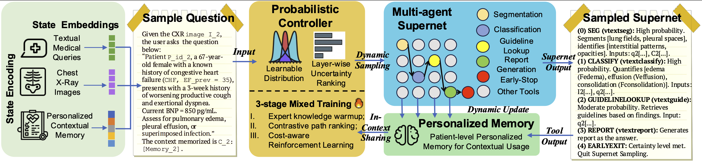

# PASS-Code

Implementation for the paper 'PASS: Probabilistic Agentic Supernet Sampling for Interpretable and Adaptive Chest X-Ray Reasoning'.

## Framework Overview

The PASS (Probabilistic Agentic Supernet Sampling) framework provides an interpretable and adaptive approach for chest X-ray reasoning. The framework diagram above illustrates the complete architecture and workflow of our proposed method.

## Repository Status

The code and datasets will be made public upon acceptance of the paper.
